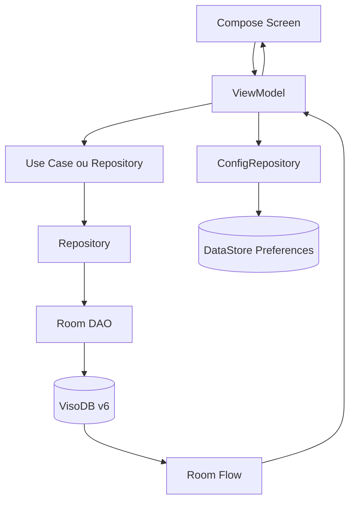
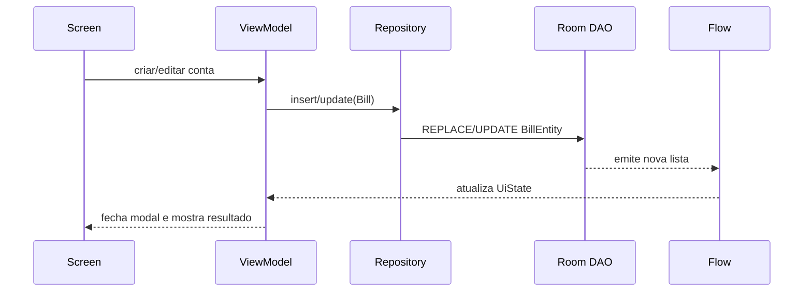
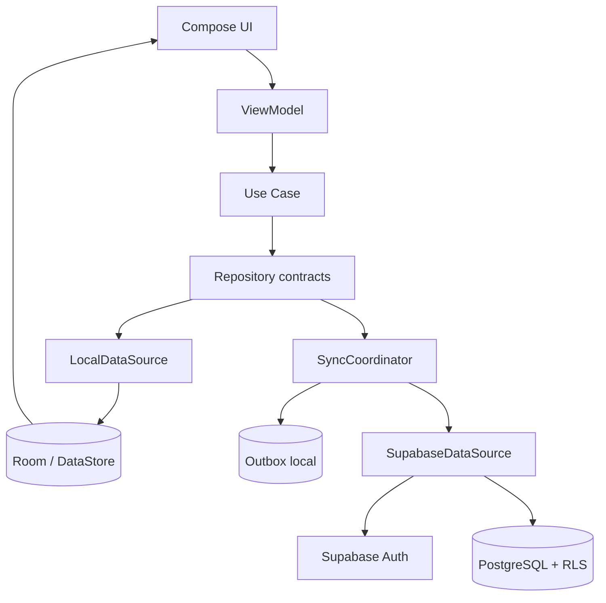
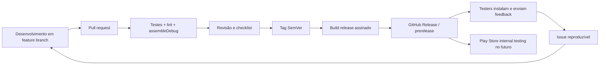

# Project Analysis

**Projeto:** Viso  
**Escopo:** arquitetura, persistência, distribuição e qualidade  
**Base analisada:** `main` em `v2.2.0` (`ba9eb22`)  
**Data da análise:** 2026-10-03

## 1. Visão geral

Viso é um aplicativo Android de finanças pessoais. O objetivo é ajudar uma pessoa a planejar o salário mensal pela regra 70-20-10, controlar contas, metas de poupança, reserva de emergência e histórico de fechamento mensal, mantendo o uso principal disponível offline.

O projeto foi desenvolvido como um aplicativo pessoal com uma experiência simples e local. A expansão para usuários reais começou com autenticação e backup opcional via Firebase/Firestore, publicação de APK em GitHub Releases e um script de instalação por ADB.

### Estado atual

- Aplicativo Android em um único módulo Gradle: `:app`.
- UI em Jetpack Compose + Material 3.
- MVVM com ViewModels e `StateFlow`.
- Domínio separado em modelos e use cases, mas ainda com algumas violações de camada.
- Room v6 é a fonte local dos dados financeiros.
- DataStore Preferences guarda configurações do aplicativo.
- Firebase Auth e Firestore existem como backup/sincronização opcional, não como backend principal completo.
- GitHub Actions publica um APK debug quando uma tag `v*` é criada.
- Há 3 classes de teste unitário e 1 classe de teste instrumentado; não há testes de migração, sincronização ou release.

### Tecnologias

| Área | Tecnologia |
|---|---|
| Linguagem | Kotlin 1.9.24 |
| Android | AGP 8.5.2, compile/target SDK 34, min SDK 26 |
| UI | Jetpack Compose, Material 3, Navigation Compose |
| Estado e concorrência | ViewModel, StateFlow, Kotlin Coroutines |
| Persistência local | Room 2.6.1, DataStore Preferences 1.1.1 |
| DI | Hilt 2.51.1 |
| Nuvem atual | Firebase Auth, Firestore e serviços Firebase |
| Jobs e notificações | WorkManager, BroadcastReceiver, alarmes exatos |
| Widget | Glance AppWidget |
| Distribuição | GitHub Releases, APK manual e ADB |

## 2. Arquitetura atual

### 2.1 Organização de pastas

```text
Viso/
├── app/
│   ├── build.gradle.kts
│   ├── google-services.json
│   └── src/
│       ├── main/java/com/viso/
│       │   ├── data/
│       │   │   ├── auth/          # Firebase Auth
│       │   │   ├── datastore/     # preferências de configuração
│       │   │   ├── db/             # Room, DAOs e entidades
│       │   │   ├── notifications/  # Worker
│       │   │   ├── repository/     # acesso a dados local
│       │   │   └── sync/           # FirestoreSyncManager
│       │   ├── domain/
│       │   │   ├── model/          # entidades de negócio
│       │   │   └── usecase/        # regras e orquestrações
│       │   ├── notification/       # receivers e agendamento
│       │   ├── ui/                 # telas, ViewModels e componentes
│       │   ├── widget/             # widget Glance
│       │   ├── MainActivity.kt
│       │   └── MainApplication.kt
│       ├── test/                   # testes unitários
│       └── androidTest/            # testes instrumentados
├── .github/workflows/              # release por tag
├── gradle/                         # catálogo de versões e wrapper
├── README.md
├── TODO.md
└── instalar-no-celular.bat
```

A estrutura é compreensível para o tamanho atual. O principal problema não é a quantidade de pastas, mas algumas responsabilidades atravessando fronteiras: `ReportsRepository` está em `ui/reports`, repositórios concretos conhecem o Firestore, e alguns ViewModels fazem orquestrações que deveriam estar em use cases.

### 2.2 Fluxo de dados normal



A leitura é reativa para a maior parte das telas: DAOs expõem `Flow`, repositórios convertem entidades Room em modelos de domínio e ViewModels combinam fluxos com `combine`. Escritas são chamadas suspensas nos ViewModels ou use cases e a UI recebe mensagens por `SharedFlow`.

### 2.3 Abertura do aplicativo

1. `MainApplication` cria o canal de notificações.
2. Hilt fornece `VisoDB`, DAOs, DataStore, Firebase Auth e Firestore.
3. `MainActivity` inicia o Compose e o `VisoNavGraph` decide entre onboarding, login e área principal.
4. Os ViewModels carregam o estado local.
5. Quando o usuário autentica, `LoginViewModel` chama `SyncUseCase.pullFromCloud()` antes de navegar para a Home.

O modo offline continua possível porque o login pode ser pulado e as telas usam Room/DataStore diretamente.

### 2.4 Contas e metas



`BillRepository.insert` também faz deduplicação por nome, valor, vencimento, categoria e `dueMonth`. Isso é útil para evitar duplicatas acidentais, mas não é uma identidade de negócio completa: duas contas diferentes com os mesmos dados podem ser consideradas duplicadas.

### 2.5 Fechamento mensal

`CloseMonthUseCase` lê configuração, contas do mês, pagamentos e entradas extras; cria `PaymentHistory`, salva `MonthHistory`, reseta contas recorrentes, remove contas avulsas pagas, remove entradas extras, atualiza o mês de reset e atualiza streaks/conquistas.

O fluxo funciona, mas executa várias escritas independentes. Não existe transação Room cobrindo o fechamento inteiro. Uma interrupção no meio pode deixar o histórico, as contas e o DataStore em estados diferentes.

### 2.6 Notificações e jobs

- `BillAlarmReceiver` agenda lembretes de contas.
- `MonthSetupReminderReceiver` lembra a abertura do mês.
- `BootReceiver` reagenda alarmes após reinício.
- `NotificationWorker` consulta contas próximas do vencimento.
- `NotificationHelper` cria canais e verifica permissões.

O `BootReceiver` inicia um `CoroutineScope(Dispatchers.IO)` diretamente no receiver. Esse escopo não está ligado ao ciclo de vida do broadcast; o processo pode ser encerrado antes de a operação terminar. A operação deve ser delegada a WorkManager ou usar `goAsync()` com conclusão garantida.

## 3. TASK 1 — Persistência e migração para Supabase

### 3.1 Onde os dados estão hoje

#### Room

`VisoDB` está na versão 6 e contém:

| Tabela | Papel | Observação |
|---|---|---|
| `bills` | contas mensais | `dueMonth` separa mês da conta de `paidMonth` |
| `installment_bills` | planos de parcelamento | controla o plano ativo |
| `goals` | metas e reserva | saldo atual fica mutável na própria linha |
| `extra_incomes` | entradas extras | particionadas por `month` |
| `month_history` | resumo de fechamento | histórico mensal agregado |
| `payment_history` | contas pagas | histórico detalhado por mês |
| `achievements` | conquistas | progresso e desbloqueio |

As migrações estão em `data/db/VisoDB.kt`/`di/AppModule.kt`, das versões 1 a 6. `exportSchema = false` impede guardar o schema Room gerado no repositório, o que reduz a capacidade de revisar e testar migrações automaticamente.

#### DataStore

`ConfigDataStore` guarda salário, dias de recebimento, modo de salário, notificações, reset automático, streaks e o mês da abertura revisada. Esses dados não estão no Room e não participam da sincronização atual.

#### Firebase atual

O caminho remoto usado é:

```text
users/{uid}/bills/{billId}
users/{uid}/goals/{goalId}
```

O `FirestoreSyncManager` implementa leitura pontual, listeners e escrita para contas/metas. Na prática, o `SyncUseCase` usado no login faz apenas pull, aplica dados remotos localmente e envia entidades locais ausentes na nuvem. Não há sincronização equivalente para configurações, entradas extras, parcelamentos, histórico, conquistas ou exclusões.

### 3.2 Fluxo atual de leitura, escrita e exclusão

| Operação | Fluxo atual |
|---|---|
| Leitura de conta | `BillDao` → `BillRepository` → `BillsViewModel` → Compose |
| Criação de conta | `BillsViewModel` → `BillRepository.insert` → Room `REPLACE` |
| Edição de conta | `BillsViewModel` → `BillRepository.update` → Room `UPDATE` |
| Pagamento | DAO atualiza `isPaid`/`paidMonth`; histórico detalhado é criado no fechamento |
| Exclusão | ViewModel → repository → `DELETE` por id |
| Meta | `GoalRepository` → `GoalDao`; movimentos alteram `currentAmountCents` |
| Configuração | `ConfigRepository` → DataStore Preferences |
| Fechamento | `CloseMonthUseCase` coordena vários repositories e DataStore |
| Nuvem | login bem-sucedido → `SyncUseCase.pullFromCloud` |

### 3.3 Acoplamentos que precisam ser controlados

1. ViewModels conhecem repositories concretos, em vez de contratos de domínio.
2. `BillRepository` e `GoalRepository` conhecem diretamente `FirestoreSyncManager`; persistência local e remota estão misturadas.
3. `SyncUseCase` importa uma classe concreta de infraestrutura (`FirestoreSyncManager`) dentro do pacote de domínio.
4. `Config` é um modelo de domínio alimentado diretamente por chaves do DataStore.
5. O modelo `Bill` usa strings para mês (`YYYY-MM` ou vazio), sem um tipo/invariante centralizado.
6. O saldo de uma meta é um valor mutável; não existe um ledger de depósitos e retiradas para auditoria.
7. O fechamento usa exclusão física de contas avulsas após registrar o histórico.

### 3.4 O Supabase faz sentido?

**Veredito:** Supabase é tecnicamente adequado como backend remoto para uma segunda etapa, mas não deve substituir Room diretamente agora.

Ele faz sentido quando o Viso precisar de:

- acesso do mesmo usuário em mais de um aparelho;
- backup remoto com banco relacional;
- consultas históricas e relatórios mais completos;
- autenticação e controle de dados por usuário;
- uma base PostgreSQL que possa crescer para múltiplos usuários.

Ele não resolve sozinho:

- sincronização offline;
- conflito entre dois aparelhos;
- migração de usuários anônimos;
- transformação do modelo atual em dados históricos consistentes;
- atomicidade de regras que hoje envolvem Room e DataStore;
- política de retenção, exclusão e exportação de dados.

Para o público atual, uma troca direta acrescentaria complexidade, dependência de rede e custo operacional sem benefício proporcional. A recomendação é manter **Room como cache/fonte operacional offline** e introduzir Supabase como **fonte remota sincronizada** para usuários autenticados.

### 3.5 Arquitetura de persistência proposta



#### Banco PostgreSQL proposto

Usar `uuid` como id, `user_id uuid not null references auth.users(id)`, `created_at`, `updated_at` e `deleted_at`/tombstone nas entidades sincronizadas.

Tabelas iniciais:

- `profiles`: perfil mínimo do usuário e versão do schema do perfil.
- `user_configs`: equivalente sincronizável do DataStore.
- `bills`: contas e ocorrências mensais.
- `installment_plans`: parcelamentos, com vínculo das ocorrências.
- `goals`: definição da meta.
- `goal_transactions`: depósitos e retiradas, em vez de apenas sobrescrever o saldo.
- `extra_incomes`: entradas extras por mês.
- `month_closures`: resumo e estado do fechamento.
- `payment_history`: histórico imutável de pagamentos.
- `achievements`: progresso por usuário.

Antes do schema final, deve ser decidido se `bills` continuará representando uma ocorrência mutável ou se haverá `recurring_bill_templates` + `bill_occurrences`. Para sincronização multi-dispositivo, a segunda opção é mais segura: pagamento futuro não altera silenciosamente a mesma linha recorrente.

Mês deve ser armazenado como `date` sempre no primeiro dia do mês, ou como `text` validado por constraint `YYYY-MM`; a escolha precisa ser única em todas as tabelas. Recomenda-se `date`, porque PostgreSQL pode validar e ordenar naturalmente.

#### Autenticação e RLS

- Escolher uma única autoridade de identidade para a nova arquitetura: Supabase Auth.
- Durante a transição, manter Firebase Auth apenas até a migração dos usuários; não misturar ids Firebase e Supabase como se fossem a mesma identidade.
- Toda tabela de usuário deve ter `user_id` e políticas RLS com `user_id = auth.uid()`.
- Testar RLS com usuário A, usuário B e sessão anônima/expirada.
- A chave pública/anon do Supabase pode estar no aplicativo, desde que RLS esteja correto. Service role key nunca deve estar no APK, no código ou em um workflow de build público.
- O Google client id hardcoded em `LoginScreen` não é um segredo de servidor, mas deve ser movido para configuração de build para evitar duplicação e erro entre ambientes.

#### Offline-first e conflitos

Adicionar uma outbox local, por exemplo `sync_operations`, com:

```text
operation_id, entity_type, entity_id, operation, payload,
created_at, attempts, last_error, synced_at
```

Cada escrita local atualiza Room e registra uma operação. Um `SyncCoordinator` envia operações idempotentes quando há rede, com retry e backoff. O remoto devolve `updated_at`/versão. Para a primeira versão, last-write-wins por entidade é aceitável, desde que:

- exclusões usem tombstones;
- o usuário veja erro de sincronização;
- pagamentos e movimentações de metas possam ser idempotentes;
- o servidor não aceite uma atualização de outro usuário;
- conflitos de saldo sejam resolvidos por transações, não por soma cega.

### 3.6 Migração de dados existentes

1. Congelar e documentar o contrato atual de `Bill`, `Goal`, `Config` e meses.
2. Criar exportador local versionado para Room + DataStore em JSON/NDJSON.
3. Gerar `user_id` remoto para cada conta autenticada e vincular dados locais a ele.
4. Normalizar meses vazios de `dueMonth`; não adivinhar silenciosamente valores ambíguos.
5. Fazer upsert idempotente por id original e guardar `legacy_source_id` durante a migração.
6. Migrar metas para `goals` e criar uma transação inicial de saldo em `goal_transactions`.
7. Migrar históricos antes de permitir fechamento remoto.
8. Validar contagens, soma de valores e amostras por usuário.
9. Manter rollback para Room e não apagar dados locais até a validação remota terminar.
10. Fazer migração por coorte pequena, com telemetria e opção de repetir sem duplicar.

### 3.7 Estado atual → estado proposto → etapas

| Estado atual | Estado proposto | Etapas necessárias |
|---|---|---|
| Room + DataStore locais | Room/DataStore continuam operacionais offline | Formalizar contratos e invariantes |
| Firestore parcial e manual | Supabase como backend remoto autenticado | Definir Auth, schema, RLS e ambientes |
| Sync no login, cloud wins | Outbox, retry, cursor/versão e tombstones | Implementar coordenador e testes de conflito |
| Apenas bills/goals remotos | Todas as entidades relevantes com escopo definido | Migrar configs, extras, parcelamentos e históricos |
| Saldo de meta sobrescrito | Ledger de transações | Criar movimentos idempotentes e recalcular saldo |
| Meses string/vazio | Tipo único e validado | Backfill local e constraint remoto |
| Sem backup operacional documentado | Exportação e restauração testadas | Definir rotina e retenção |

### 3.8 Tasks executáveis da persistência

#### DATA-01 — Definir contrato de identidade e mês

- **Objetivo:** fixar regras para `id`, `user_id`, `dueMonth`, `paidMonth`, mês vazio e contas recorrentes.
- **Motivo:** sem isso, qualquer banco remoto reproduzirá inconsistências atuais.
- **Arquivos/módulos:** `domain/model/Bill.kt`, use cases de mês, documentação de domínio.
- **Dependências:** nenhuma.
- **Conclusão:** documento de invariantes + testes de conversão para os casos atual, próximo mês, mês curto e pagamento antecipado.
- **Prioridade:** ALTO.

#### DATA-02 — Exportar schema Room e criar testes de migração

- **Objetivo:** versionar schemas e testar v1→v6 e futuras migrações.
- **Motivo:** a base atual usa `exportSchema = false` e não tem cobertura de upgrade.
- **Arquivos/módulos:** `VisoDB.kt`, `AppModule.kt`, `app/schemas/`, `androidTest`.
- **Dependências:** nenhuma.
- **Conclusão:** schemas no Git, teste que cria banco v1 e verifica cada versão sem perda inesperada.
- **Prioridade:** ALTO.

#### DATA-03 — Separar contratos de repositório de Room e Firebase

- **Objetivo:** fazer ViewModels/use cases dependerem de interfaces e mover adaptadores para `data/local` e `data/remote`.
- **Motivo:** Supabase não deve exigir reescrever UI ou domínio.
- **Arquivos/módulos:** `data/repository/*`, `data/sync/FirestoreSyncManager.kt`, `domain/usecase/SyncUseCase.kt`, módulos Hilt.
- **Dependências:** DATA-01.
- **Conclusão:** compilação usando `BillDataRepository`, `GoalDataRepository` e `RemoteDataSource` sem import de Firebase no domínio.
- **Prioridade:** ALTO.

#### DATA-04 — Criar schema Supabase e políticas RLS em migrations

- **Objetivo:** criar tabelas iniciais, índices, constraints e políticas por usuário.
- **Motivo:** segurança e reprodutibilidade precisam estar no código, não apenas no painel.
- **Arquivos/módulos:** novo `supabase/migrations/`, `supabase/seed.sql`, documentação de ambiente.
- **Dependências:** DATA-01 e escolha de Auth.
- **Conclusão:** migrations aplicáveis do zero; testes de isolamento entre dois usuários; nenhuma tabela de usuário acessível sem RLS.
- **Prioridade:** ALTO.

#### DATA-05 — Implementar outbox e coordenador de sincronização

- **Objetivo:** persistir escrita local primeiro e sincronizar com retry, idempotência e tombstones.
- **Motivo:** o sync atual não cobre offline, exclusão nem conflitos.
- **Arquivos/módulos:** Room (`sync_operations`), `data/sync/SyncCoordinator`, WorkManager, contratos remotos.
- **Dependências:** DATA-03 e DATA-04.
- **Conclusão:** escrita sem rede aparece localmente, é enviada quando a rede volta, não duplica e reporta falha persistente.
- **Prioridade:** ALTO.

#### DATA-06 — Migrar autenticação e dados em coorte controlada

- **Objetivo:** levar usuários existentes e novos para Supabase Auth/Database sem perder Room.
- **Motivo:** uma troca global sem vínculo de identidade pode misturar ou perder contas.
- **Arquivos/módulos:** `data/auth`, importador local, Supabase migrations/functions, tela de conta.
- **Dependências:** DATA-01 a DATA-05.
- **Conclusão:** export/import idempotente, contagens conferidas, rollback documentado e piloto com usuários voluntários.
- **Prioridade:** ALTO.

## 4. TASK 2 — Versionamento, distribuição e liberação

### 4.1 Estado atual

- Repositório com branch `main` e tag `v2.2.0`.
- `versionCode = 22` e `versionName = 2.2.0` em `app/build.gradle.kts`.
- README contém o changelog; não há `CHANGELOG.md` separado.
- Workflow `.github/workflows/release-apk.yml` dispara em tags `v*`.
- O workflow executa `assembleDebug` e publica `app-debug.apk` como release.
- O APK é debug-signed, sem keystore de release e sem checksum no asset.
- Não existe workflow de pull request/push executando testes e lint antes de uma tag.
- `instalar-no-celular.bat` é adequado para desenvolvimento local via ADB.

O modelo atual é suficiente para poucos testadores técnicos, mas não deve ser chamado de release estável pública. APK debug não fornece a mesma garantia de identidade, atualização e controle de distribuição de um APK/AAB assinado para produção.

### 4.2 Estratégia simples recomendada

#### Branches

- `main`: código liberável.
- `feature/<nome>`: desenvolvimento de uma mudança.
- `fix/<nome>`: correções.
- Pull request para `main`, mesmo em projeto solo, para preservar histórico e fazer CI.
- Evitar branches de release permanentes enquanto a equipe for pequena.

#### SemVer e Android

- Correção compatível: `2.2.1`, `versionCode` incrementado.
- Funcionalidade compatível: `2.3.0`.
- Mudança incompatível: `3.0.0`.
- Teste externo: `2.3.0-alpha.1` ou `2.3.0-beta.1`.
- Cada tag é imutável: `v2.3.0-alpha.1`.
- `versionCode` sempre cresce, inclusive entre alpha, beta e stable.

#### Canais

1. `alpha`: autor e poucos testers; GitHub Release marcada como prerelease.
2. `beta`: grupo externo pequeno; APK release assinado e notas de mudança.
3. `stable`: versão com checklist concluído; GitHub Release pública e, depois, Play Console.

### 4.3 Fluxo recomendado



### 4.4 CI/CD mínimo

#### Workflow de qualidade

Executar em push e pull request:

```text
./gradlew testDebugUnitTest
./gradlew lintDebug
./gradlew assembleDebug
```

Instrumented tests podem rodar em um job separado com emulator quando a cobertura justificar o custo.

#### Workflow de release

Executar em tags:

1. Repetir testes e lint.
2. Validar que tag, `versionName` e `versionCode` correspondem.
3. Decodificar keystore a partir de GitHub Secrets.
4. Executar `assembleRelease` ou gerar AAB para Play Store.
5. Gerar SHA-256 do APK/AAB.
6. Publicar artefato e notas no GitHub Release.
7. Marcar alpha/beta como prerelease.

Secrets necessários para assinatura: keystore em base64, senha do keystore, alias e senha da chave. Nunca versionar o keystore. O `google-services.json` e chaves públicas de SDK não substituem proteção de secrets de assinatura ou service accounts.

### 4.5 Feedback e Play Store

Para agora, GitHub Releases é suficiente se as notas informarem Android mínimo, permissões, hash do arquivo e canal de feedback. Para usuários não técnicos, a próxima evolução simples é Google Play Console Internal Testing com AAB. A Play Store elimina a instalação manual e centraliza atualizações, mas exige conta de desenvolvedor, política de privacidade, ícone/metadata, assinatura e revisão de requisitos.

### 4.6 Tasks executáveis de distribuição

#### REL-01 — Criar CI de qualidade para PR e push

- **Objetivo:** impedir que uma tag seja a primeira validação do código.
- **Motivo:** hoje só existe automação de release; regressões podem chegar até a publicação.
- **Arquivos/módulos:** novo `.github/workflows/quality.yml`.
- **Dependências:** nenhuma.
- **Conclusão:** PR/push executa testes unitários, lint e debug build; falha bloqueia merge.
- **Prioridade:** ALTO.

#### REL-02 — Configurar build release assinado

- **Objetivo:** substituir APK debug por APK release para beta/stable.
- **Motivo:** distribuição pública precisa de identidade de assinatura e atualização confiável.
- **Arquivos/módulos:** `app/build.gradle.kts`, `gradle.properties`/secrets, workflow de release.
- **Dependências:** REL-01; geração segura de keystore.
- **Conclusão:** CI gera `assembleRelease`, assina sem expor credenciais e publica hash.
- **Prioridade:** ALTO.

#### REL-03 — Validar SemVer, tag e artefato automaticamente

- **Objetivo:** alinhar `versionCode`, `versionName`, tag, nome do arquivo e canal prerelease.
- **Motivo:** evitar release com versão incorreta ou impossível de atualizar.
- **Arquivos/módulos:** workflow, script de validação, `app/build.gradle.kts`.
- **Dependências:** REL-01.
- **Conclusão:** tag incompatível falha antes do upload; alpha/beta ficam marcadas como prerelease.
- **Prioridade:** MÉDIO.

#### REL-04 — Separar changelog e checklist de release

- **Objetivo:** registrar mudanças, migrações, permissões, riscos conhecidos e instruções de atualização.
- **Motivo:** o README atual mistura manual do produto com histórico.
- **Arquivos/módulos:** novo `CHANGELOG.md`, `docs/RELEASE_CHECKLIST.md`, README.
- **Dependências:** nenhuma.
- **Conclusão:** toda release tem notas reproduzíveis, hash e checklist preenchido.
- **Prioridade:** MÉDIO.

#### REL-05 — Preparar canal Play Internal Testing

- **Objetivo:** oferecer atualização simples para um grupo fechado antes da publicação ampla.
- **Motivo:** reduz instalação manual e preserva baixo custo operacional.
- **Arquivos/módulos:** workflow, configuração Play Console, política de privacidade e metadata.
- **Dependências:** REL-02 e REL-03.
- **Conclusão:** AAB release chega ao canal interno com testers convidados e rollback por versão anterior.
- **Prioridade:** MÉDIO.

## 5. TASK 3 — Auditoria de arquitetura e qualidade

### 5.1 O que está bem estruturado

- Modelos de domínio e regras financeiras não estão diretamente dentro dos composables.
- Room DAOs são pequenos e usam `Flow` para leituras reativas.
- Hilt centraliza as dependências principais.
- A separação `ui`, `domain`, `data` é fácil de navegar.
- Valores monetários são representados em centavos (`Long`), evitando `Double` para dinheiro.
- O campo `dueMonth` resolveu uma necessidade real de contas pagas antecipadamente.
- Há testes de repository e um teste instrumentado de relatório.
- O README explica funcionalidades e instalação melhor que a maioria dos projetos pessoais.

### 5.2 Problemas classificados

Não foi comprovado um problema **CRÍTICO** somente pela inspeção estática. O bloqueador crítico para ativar um backend novo seria publicar tabelas sem RLS testado; por isso RLS é condição de conclusão da Task DATA-04, não uma suposição.

| ID | Prioridade | Evidência | Impacto | Recomendação |
|---|---|---|---|---|
| AUD-01 | ALTO | `SyncUseCase` sincroniza apenas bills/goals, cloud wins, sem outbox ou deleções | Pode perder alterações locais ou deixar dispositivos divergentes | Contratos remotos, outbox, versões, tombstones e política de conflito |
| AUD-02 | ALTO | `CloseMonthUseCase` executa várias escritas separadas | Fechamento interrompido pode produzir histórico parcial e estado inconsistente | Transação Room para dados locais e estado de fechamento idempotente |
| AUD-03 | ALTO | Release workflow executa `assembleDebug` e publica APK debug | Usuários recebem artefato sem assinatura de produção e sem validação de release | Keystore protegido, `assembleRelease`, CI pré-tag e hash |
| AUD-04 | ALTO | `exportSchema = false`; não há testes de migration | Alterações de schema podem quebrar instalações existentes | Exportar schemas, testar upgrades e documentar backfill |
| AUD-05 | ALTO | Fechamento remove contas avulsas; meta guarda só saldo atual | Auditoria, restauração e resolução de conflito ficam frágeis | Ledger de metas, histórico imutável e ocorrências de contas |
| AUD-06 | ALTO | Configuração fica apenas em DataStore e não entra no sync | Outro dispositivo não reproduz salário, notificações ou modo de pagamento | Criar `user_configs` remoto após definir o contrato |
| AUD-07 | MÉDIO | `BootReceiver` abre `CoroutineScope` próprio | Trabalho pode ser encerrado antes de concluir após reboot | WorkManager ou `goAsync()` com timeout e conclusão |
| AUD-08 | MÉDIO | `AgendaViewModel.previousMonth/nextMonth` chama `loadData()` repetidamente, criando collectors | Pode haver coleta duplicada, trabalho excessivo e estado difícil de rastrear | Um fluxo baseado em `yearMonth` com `flatMapLatest` |
| AUD-09 | MÉDIO | `ReportsRepository` está em `ui/reports` e acessa DAO diretamente | A tela conhece persistência e a camada de dados fica inconsistente | Mover para `data/repository` ou use case de relatórios |
| AUD-10 | MÉDIO | Repositories concretos e `FirestoreSyncManager` opcional dentro deles | Testes e troca de backend ficam mais difíceis | Interfaces de repository e data sources injetáveis |
| AUD-11 | MÉDIO | Conversões Entity/Domain e mensagens de erro estão espalhadas | Mudanças de modelo podem gerar comportamento divergente | Mappers/testes centralizados e erros tipados |
| AUD-12 | MÉDIO | Há `catch(Throwable)` com fallback vazio em `ConfigViewModel` | Erros reais podem ser escondidos e o usuário vê dados incompletos | Capturar exceções esperadas, log estruturado e estado de erro explícito |
| AUD-13 | MÉDIO | Cobertura atual: 3 unit tests e 1 instrumented test | Regras de mês, reset, notificações e sync podem regredir sem detecção | Testes de use case, ViewModel, migration, sync e notificação |
| AUD-14 | MÉDIO | Regras de mês são strings e `dueMonth` aceita vazio | Consultas e migrações podem interpretar o mesmo dado de formas diferentes | Value object/normalizador e constraints |
| AUD-15 | BAIXO | `TODO.md`, README e código são as fontes de planejamento/histórico | Decisões podem ficar sem dono e perder contexto | Manter ADRs, roadmap e changelog separados |
| AUD-16 | BAIXO | Não há documentação de regras do Firestore, backup ou ambiente remoto | Não é possível auditar segurança e recuperar o serviço com confiança | Versionar regras/migrations e runbook de backup/restore |
| AUD-17 | BAIXO | Client id do Google está literal em `LoginScreen` | Configuração por ambiente é frágil e duplicada | `resValue`, `BuildConfig` ou recurso configurável por ambiente |

### 5.3 Qualidade, concorrência e ciclo de vida

#### Validações

As telas já validam valores monetários, dias de recebimento e limites principais. Ainda falta concentrar invariantes de domínio: dia entre 1 e 31, mês válido, valor não negativo, parcela entre 2 e 48, saldo de retirada e identidade de contas duplicadas.

#### Concorrência

Os ViewModels usam `viewModelScope`, o que é adequado para ações de tela. O ponto fora do padrão é o receiver de boot. Também é possível disparar várias gravações de configuração em sequência; isso deve ser encapsulado quando uma operação precisa ser atômica.

#### Null safety

O Kotlin reduz riscos, mas `FirestoreSyncManager` faz parsing manual de documentos e pode descartar campos com `mapNotNull` sem registrar a razão. Isso pode fazer dados remotos desaparecerem da visão local sem diagnóstico.

#### Observabilidade

As mensagens de erro melhoraram, porém ainda são strings de UI. Falta um modelo que diferencie validação, persistência, rede, autenticação, migração e notificação, junto com logs sem valores financeiros sensíveis.

### 5.4 Testes que faltam

- Migração Room 1→6 e criação limpa.
- `CloseMonthUseCase` com zero contas, contas futuras, mês curto, pendências e repetição do fechamento.
- Deduplicação de conta usando `dueMonth`.
- Movimentos de entrada e retirada de metas, incluindo saldo insuficiente.
- `dueMonth`/`paidMonth` para pagamento antecipado.
- Notificação após reboot e permissão negada.
- `SyncUseCase` com cloud vazia, ids iguais, exclusões e falha de rede.
- RLS com dois usuários no backend escolhido.
- ViewModels: erro de persistência, fechamento de modal e estado de loading.
- Release: assinatura, versão, minificação e instalação/upgrade sobre versão anterior.

### 5.5 Tasks executáveis de arquitetura e qualidade

#### ARCH-01 — Tornar fechamento mensal transacional e idempotente

- **Objetivo:** garantir que repetir ou interromper o fechamento não duplique histórico nem perca contas.
- **Motivo:** o caso de uso hoje coordena várias escritas sem uma unidade atômica.
- **Arquivos/módulos:** `CloseMonthUseCase.kt`, DAOs de bills/history/payment history, `VisoDB.kt`.
- **Dependências:** DATA-01; definir o que é histórico imutável.
- **Conclusão:** transação cobre Room, fechamento repetido produz o mesmo resultado e testes simulam falha entre etapas.
- **Prioridade:** ALTO.

#### ARCH-02 — Corrigir ciclo de vida de jobs de boot

- **Objetivo:** reagendar notificações de forma garantida após reinício.
- **Motivo:** `CoroutineScope` solto em BroadcastReceiver não garante conclusão.
- **Arquivos/módulos:** `notification/BootReceiver.kt`, `BootReceiverEntryPoint.kt`, `data/notifications/NotificationWorker.kt`.
- **Dependências:** nenhuma.
- **Conclusão:** job enfileirado no WorkManager, retry configurado e teste de receiver/worker documentado.
- **Prioridade:** MÉDIO.

#### ARCH-03 — Unificar fluxo de mês na Agenda

- **Objetivo:** remover collectors duplicados ao navegar entre meses.
- **Motivo:** cada chamada de `loadData()` inicia um novo `collect` no mesmo ViewModel.
- **Arquivos/módulos:** `ui/agenda/AgendaViewModel.kt`.
- **Dependências:** DATA-01.
- **Conclusão:** existe um collector de longa duração; mudar o mês cancela o anterior e o teste verifica uma única emissão.
- **Prioridade:** MÉDIO.

#### ARCH-04 — Criar erros de domínio e observabilidade mínima

- **Objetivo:** diferenciar validação, armazenamento, sincronização, autenticação e notificações.
- **Motivo:** mensagens livres e `catch(Throwable)` dificultam diagnóstico.
- **Arquivos/módulos:** novo `domain/error`, ViewModels, repositories, logger redigido.
- **Dependências:** nenhuma.
- **Conclusão:** UI recebe mensagens amigáveis, logs têm código/categoria, e nenhum log contém token ou payload financeiro completo.
- **Prioridade:** MÉDIO.

#### ARCH-05 — Ampliar testes de negócio e integração

- **Objetivo:** proteger regras financeiras e regressões de infraestrutura.
- **Motivo:** a cobertura atual é pequena para o número de fluxos.
- **Arquivos/módulos:** `app/src/test`, `app/src/androidTest`, fixtures Room e fake remote.
- **Dependências:** ARCH-01, DATA-01 e DATA-03.
- **Conclusão:** matriz de testes da seção 5.4 coberta, com testes determinísticos de tempo e rede.
- **Prioridade:** ALTO.

#### ARCH-06 — Mover relatório para a camada de dados/domínio

- **Objetivo:** impedir acesso direto de `ui/reports` ao DAO.
- **Motivo:** manter uma única direção de dependência.
- **Arquivos/módulos:** `ui/reports/ReportsRepository.kt`, novo repository/use case em `data`/`domain`, DI.
- **Dependências:** DATA-03.
- **Conclusão:** UI depende apenas de ViewModel/use case e os testes continuam passando.
- **Prioridade:** BAIXO.

## 6. Decisões arquiteturais

### ADRs criados

- [ADR 001 — Room permanece local e Supabase entra como backend sincronizado](adr/001-room-local-supabase-sync.md)
- [ADR 002 — Release gradual com GitHub Releases e assinatura de produção](adr/002-release-strategy.md)

### Decisões registradas

1. Não fazer migração direta de Room para Supabase.
2. Manter offline-first como requisito do produto, não como detalhe de implementação.
3. Separar contratos de persistência local e remota antes de trocar o provedor.
4. Exigir RLS e testes de isolamento antes de qualquer dado real no Supabase.
5. Continuar com GitHub Releases para alpha/beta pequeno e preparar Play Internal Testing depois.
6. Não chamar APK debug de release estável; produção deve usar assinatura protegida.

## 7. Roadmap técnico

### Fase 1 — Organização e segurança operacional

1. DATA-01: contrato de identidade e meses.
2. DATA-02: schemas e testes de migração.
3. REL-01: CI de qualidade.
4. ARCH-02: ciclo de vida de boot.
5. ARCH-04: erros e observabilidade.
6. REL-04: changelog e checklist.

Essas tasks podem começar em paralelo, exceto quando alterarem os mesmos arquivos. DATA-01 deve ser concluída antes das mudanças de dados.

### Fase 2 — Consistência local e contratos

1. ARCH-01: fechamento transacional.
2. ARCH-03: collectors da Agenda.
3. ARCH-05: testes de negócio.
4. DATA-03: interfaces e adapters.
5. ARCH-06: mover ReportsRepository.

ARCH-03 e ARCH-06 podem ocorrer em paralelo. ARCH-01 e DATA-03 devem ter testes antes da fase remota.

### Fase 3 — Supabase controlado

1. DATA-04: schema PostgreSQL/RLS.
2. DATA-05: outbox e sincronização.
3. DATA-06: autenticação e migração piloto.

DATA-04 e DATA-05 podem ter preparação paralela, mas o código de produção só deve apontar para o remoto após RLS e conflito estarem testados.

### Fase 4 — Distribuição para usuários reais

1. REL-02: assinatura release.
2. REL-03: validação SemVer/tag.
3. Publicar alpha para poucos testers.
4. Coletar feedback por issues com versão, aparelho e passos de reprodução.
5. REL-05: Play Internal Testing quando o beta estiver estável.

## 8. Matriz de dependências e paralelismo

| Task | Depende de | Pode ocorrer em paralelo com |
|---|---|---|
| DATA-01 | nenhuma | REL-01, REL-04, ARCH-02, ARCH-04 |
| DATA-02 | nenhuma | REL-01, ARCH-02 |
| DATA-03 | DATA-01 | ARCH-03, REL-01 |
| DATA-04 | DATA-01, decisão de Auth | REL-02 preparação |
| DATA-05 | DATA-03, DATA-04 | REL-03 |
| DATA-06 | DATA-01…DATA-05 | somente documentação/release |
| ARCH-01 | DATA-01 | ARCH-02, REL-01 |
| ARCH-02 | nenhuma | ARCH-01, DATA-02 |
| ARCH-03 | DATA-01 | ARCH-06, REL-01 |
| ARCH-04 | nenhuma | quase todas |
| ARCH-05 | ARCH-01, DATA-01, DATA-03 | REL-04 |
| ARCH-06 | DATA-03 | ARCH-03, REL-01 |
| REL-01 | nenhuma | DATA-01, DATA-02, ARCH-02 |
| REL-02 | REL-01 | DATA-04 |
| REL-03 | REL-01 | DATA-05 |
| REL-04 | nenhuma | todas as tasks técnicas |
| REL-05 | REL-02, REL-03 | DATA-06 apenas se não alterar o mesmo canal |

## 9. Limitações da análise

- A análise foi estática, baseada no código, configuração e histórico disponíveis no repositório.
- Não há regras do Firestore versionadas no projeto; portanto não é possível afirmar que o isolamento atual está correto.
- Não há projeto Supabase configurado para verificar latência, custos, schema existente ou políticas reais.
- Não há Play Console ou keystore de produção disponível para validar publicação real.
- Build e testes existentes foram registrados como passando na base atual; a cobertura indicada acima continua sendo uma limitação, não uma garantia de ausência de bugs.

## 10. Critério de evolução sustentável

O Viso estará preparado para usuários reais quando conseguir: abrir e fechar meses de forma idempotente; atualizar o app sem quebrar migrações; recuperar dados locais e remotos; sincronizar sem sobrescrever alterações silenciosamente; isolar cada usuário por política testada; publicar um artefato release assinado; e explicar no README/ADRs por que cada parte existe.

## Implementation Status

Status atualizado contra o código após a análise original (`main`, `v2.2.0`, `ba9eb22`). A base foi confirmada antes das alterações. Nenhum commit foi criado nesta execução; o diff permanece rastreável por task no worktree.

### DATA-01 — DONE

Contrato centralizado em `domain/model/IdentityAndMonth.kt` e aplicado ao modelo `Bill`, aos históricos, às entradas extras e ao cálculo de ocorrência mensal.

Evidências:
- `dueMonth` explícito tem precedência sobre `paidMonth`;
- mês vazio continua representando ocorrência recorrente/legada sem mês explícito;
- conta paga exige `paidMonth`; conta não paga limpa esse campo;
- ids, valores, dia de vencimento e meses são validados;
- pagamentos antecipados e mês curto têm testes unitários.

Testes: `MonthContractTest`, `BillRepositoryTest`.

### DATA-02 — DONE

`VisoDB` agora exporta schema, os schemas `1.json` a `6.json` estão versionados em `app/schemas/` e as migrations foram extraídas para `VisoMigrations` para uso comum por produção e testes. A migração v1→v2 deixou de apagar silenciosamente metas de emergência legadas.

Testes criados: `VisoDatabaseMigrationTest` cobre criação limpa e cadeia v1→v2→v3→v4→v5→v6. A execução instrumentada passou no Moto G53 5G conectado, com 5 testes executados na suíte.

### ARCH-01 — DONE

`CloseMonthUseCase` e o reset automático usam `MonthCloseStore`. `RoomMonthCloseStore` executa histórico de pagamentos, resumo, reset de recorrentes, exclusão de avulsas e limpeza de entradas em uma transação Room. `month_history` é a chave idempotente; ids de histórico de pagamento são determinísticos.

Testes criados: `CloseMonthUseCaseTest` cobre fechamento normal, mês sem contas, contas futuras, pendências, pagamento antecipado, repetição e falha de persistência; `RoomMonthCloseStoreTest` cobre atomicidade/idempotência e rollback do primitive transacional. `RoomMonthCloseStoreTest` passou no Moto G53 5G.

### DATA-03 — PARTIAL

Foram criados contratos para repositories locais, fonte remota, configuração e fechamento mensal. `SyncUseCase` depende dos contratos e `FirestoreSyncManager` é um adapter remoto; `BillRepository` e `GoalRepository` não conhecem mais Firestore.

Ainda pendente: migrar todos os ViewModels/repositories para contratos, substituir o comportamento cloud-wins e implementar outbox/tombstones. Supabase não foi implementado nesta etapa.

### ARCH-02 — DONE / NOT VALIDATED em dispositivo

`BootReceiver` agora enfileira `BootRescheduleWorker` com WorkManager e retry; `MainApplication` fornece `HiltWorkerFactory` e remove o initializer automático conflitante.

### ARCH-05 — PARTIAL

Foram ampliados os testes de identidade/mês, fechamento, Room, migrações e persistência. A matriz completa de metas, configurações, sincronização e testes funcionais em aparelho ainda não está coberta.

### REL-01 — DONE / NOT VALIDATED no GitHub

Criado `.github/workflows/quality.yml` para push e pull request em `main`, executando unit tests, lint e assemble debug em etapas que falham independentemente.

### REL-02 — PARTIAL / NOT VALIDATED com segredo real e R8

O build `release` passou a ter configuração de assinatura por propriedades Gradle fornecidas em runtime. A validação local chegou a reconhecer a assinatura e iniciar R8, mas a minificação não concluiu nesta máquina. Nenhum keystore ou segredo foi adicionado ao repositório. A assinatura de produção depende dos GitHub Secrets descritos em `docs/IMPLEMENTATION_REPORT.md`.

### REL-03 — DONE / NOT VALIDATED no GitHub

O workflow de release valida SemVer, igualdade entre tag e `versionName`, crescimento de `versionCode`, executa testes/lint, gera `assembleRelease`, publica APK nomeado e SHA-256, e marca alpha/beta como prerelease.

### REL-04 — DONE

Criados `CHANGELOG.md`, `docs/RELEASE_CHECKLIST.md` e template de pull request.

### DATA-04, DATA-05, DATA-06, REL-05 — PENDING

Schema/RLS Supabase, outbox/sincronização distribuída, migração de identidade e Play Internal Testing permanecem para fase posterior.

### ARCH-03, ARCH-04, ARCH-06 — PENDING

Collectors da Agenda, erros de domínio/observabilidade completa e movimentação do relatório para fora de `ui` não foram alterados nesta execução.

### Auditoria residual

Os riscos `AUD-01`, `AUD-05` e `AUD-06` continuam parcialmente abertos porque sincronização distribuída, ledger de metas e configuração remota exigem decisões e testes de backend que estão fora da estabilização local desta etapa. O APK debug não é mais publicado pelo workflow de release.
